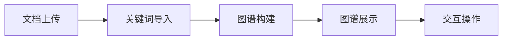
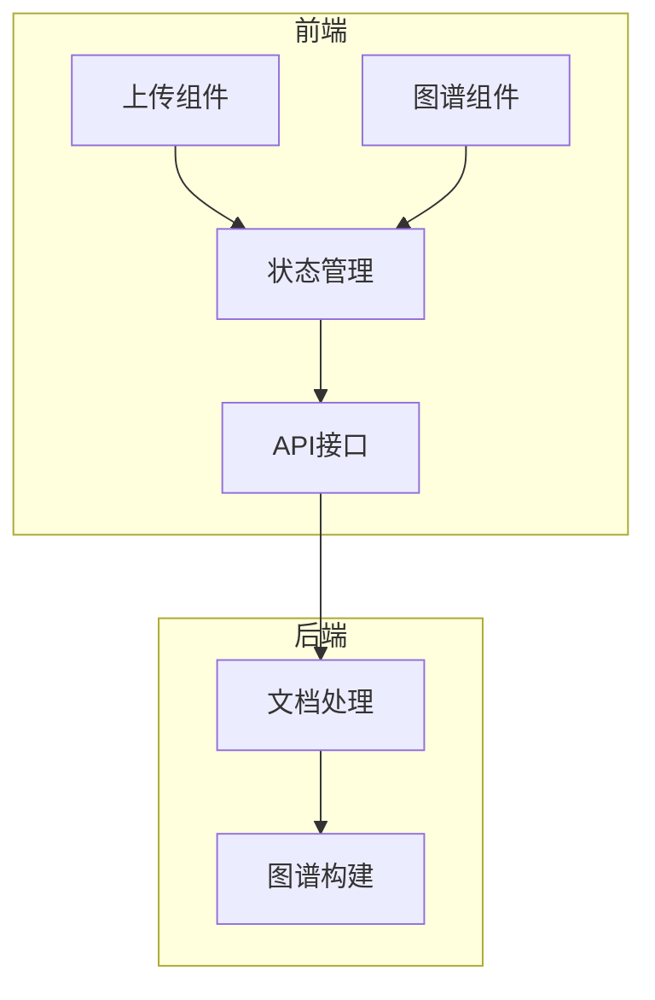
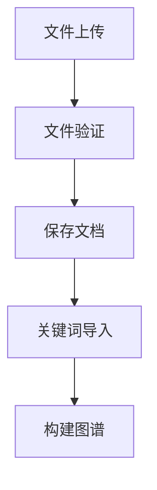
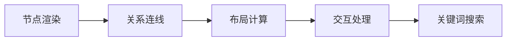
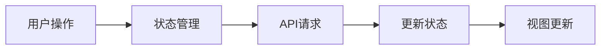

# 知识图谱构建系统前端文档

## 1. 系统概述

### 1.1 功能简介
本系统是一个知识图谱构建系统，通过上传文档和关键词，自动构建并可视化知识图谱。

### 1.2 业务流程


### 1.3 系统架构


## 2. 核心功能模块

### 2.1 文档管理


### 2.2 知识图谱展示


## 3. 组件设计

### 3.1 文件上传组件 (FileUpload.vue)
- 文档上传
  - PDF文件支持
  - 文件验证
  - 上传进度
- 关键词导入
  - 文本文件上传
  - 按行解析关键词
  - 关键词预览

### 3.2 图谱展示组件 (GraphView.vue)
- 节点展示
  - 关键词节点
  - 节点大小/颜色映射
  - 悬浮提示
- 关系展示
  - 连线样式
  - 关系强度
  - 方向指示
- 交互功能
  - 节点拖拽
  - 缩放平移
  - 关键词搜索
  - 节点点击展示详情

## 4. 数据流

### 4.1 状态管理


### 4.2 图谱数据结构
```typescript
interface GraphData {
    nodes: {
        id: string;
        label: string;
        docs: number[];    // 关联文档ID
        weight: number;    // 节点权重
    }[];
    edges: {
        source: string;
        target: string;
        weight: number;    // 关系强度
    }[];
}
```

## 5. API 接口

### 5.1 文档管理
```typescript
interface DocumentAPI {
    uploadDoc(file: File): Promise<DocResponse>;
    uploadKeywords(docId: number, file: File): Promise<KeywordResponse[]>;
    getDocGraph(docId: number): Promise<GraphData>;
}
```

### 5.2 图谱操作
```typescript
interface GraphAPI {
    getFullGraph(): Promise<GraphData>;
    searchKeyword(keyword: string): Promise<SearchResult>;
    getKeywordDetails(keywordId: string): Promise<KeywordDetail>;
}
```

## 6. 开发规范

### 6.1 技术栈
- Vue 3 + TypeScript
- D3.js 图谱渲染
- Element Plus UI
- Pinia 状态管理

### 6.2 代码规范
- TypeScript 强类型
- Vue 3 Composition API
- ESLint + Prettier
- Git 提交规范

## 7. 部署配置

### 7.1 环境变量
```env
VITE_API_BASE_URL=http://localhost:8000/api/v1
VITE_GRAPH_CONFIG={
    "nodeSize": 20,
    "linkDistance": 100,
    "charge": -400
}
```

### 7.2 构建命令
```bash
# 开发环境
npm run dev

# 生产构建
npm run build
```
